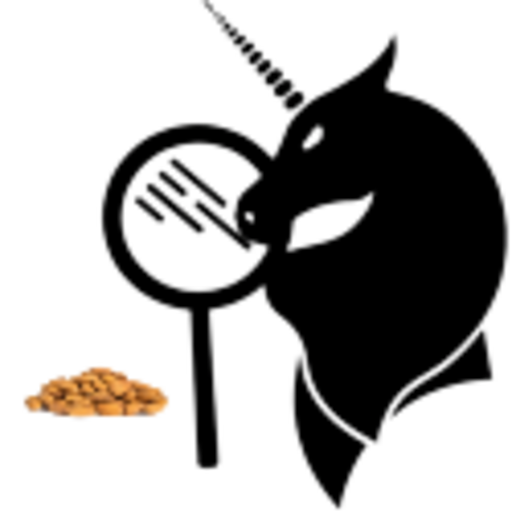

# BademSavar   
İstenmeyen websitelerini Google sonuçlarından temizleyerek kaliteli ve temiz bilgiye ulaşımı kolaylaştıran bir tarayıcı eklentisi!  
A browser extension that removes undesired websites from Google results to make easy to access high quality and clean information!
