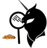

# BademSavar    

İstenmeyen websitelerini Google sonuçlarından temizleyerek kaliteli ve temiz bilgiye ulaşımı kolaylaştıran bir tarayıcı eklentisi. İlk yüklemeden sonra yanıltıcı veya rahatsız edici haber yapanlara ve içerik üretenlere ait sonuçları gizlemeye başlar.  
A browser extension that removes undesired websites from Google results to make easy to access high quality and clean information. It has an inital blocked domain list which includes lots of clickbait and deceitful websites.

**Mozilla Add-on**: https://addons.mozilla.org/en-US/firefox/addon/bademsavar/ 
**Chrome Web Store**: https://chrome.google.com/webstore/detail/bademsavar/noadoillhcglebiacnifpknfceahbnjj
